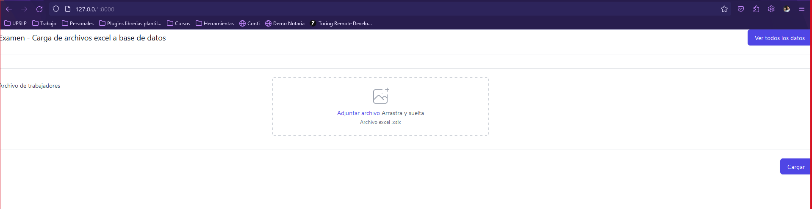
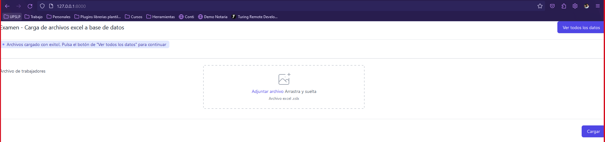
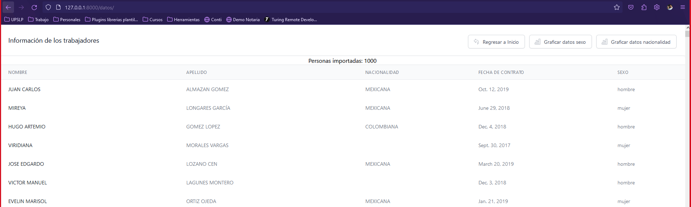
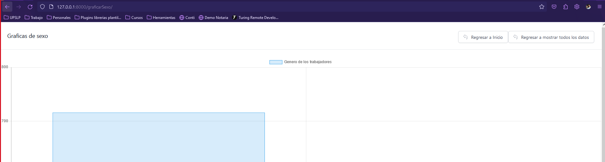
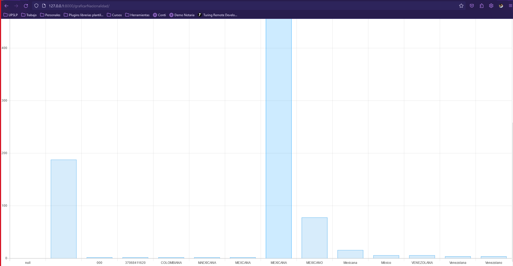
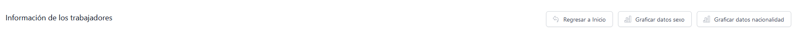

# Django – Subir Excel y graficar!

El proyecto está realizado en django, utiliza Tailwind css y una librería de js para graficar. Además para el guardado de datos se uso sqllite 3 que es lo que maneja django por defecto.
No se uso entornos viturales por problemas en configuración de mi laptop. Sin embargo si se puede utilizar en un futuro en caso de ser necesario.

# Requirements

WINDOWS
Tener instalado python. (Se uso la versión 3)
Se tiene el archivo de requirements.txt para poder realizar la instalación de todos las dependencias que ocupa el sistema. (pip3 install -r requirements.txt)
Ejecutar el proyecto con (python manage.py runserver)

# Files

Cuenta con 2 directorios principales:
 - examen (directorio principal)
 - upload_excel (Aplicación creada)

## Correr el proyecto

Clona el repositorio.
Entra vía terminal a la raíz del proyecto
Ejecuta el comando **python manage.py runserver**

## IMPORTANTE AL EJECUTAR
Por cuestiones del uso de tailwind css, cuando se le adjunta un dato, el proyecto no retroalimenta que se subio o ya esta seleccionado un archivo, sin embargo si se tiene guardada la ruta para poderlo cargar, si no se tiene nada, el mismo proyecto le dirá que no se tiene nada cargado, ya que si se cuenta con esta validación.

El proyecto tiene datos precargados para poderse usar desde el  que se corre por primera vez.

# Capturas de pantalla de ejecución

Vista de la página principal del proyecto

Restricción de subida de archivos vacia

Mensaje cuando se ha subido correctamente el archivo

Vista de todos los datos indexados vía excel

Graficas de sexo

Gráficas de nacionalidad (dinamicas, no importa el numero de nacionalidades)

Botones especiales de navegación en el proyecto.

## Dudas sobre el código

Todo el código viene comentado para cualquier duda o pregunta sobre lo realizado en el proyecto